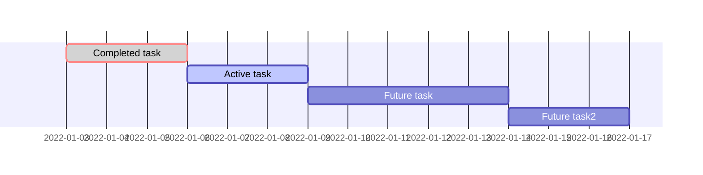
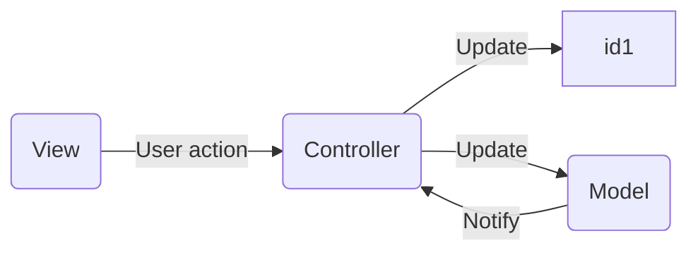
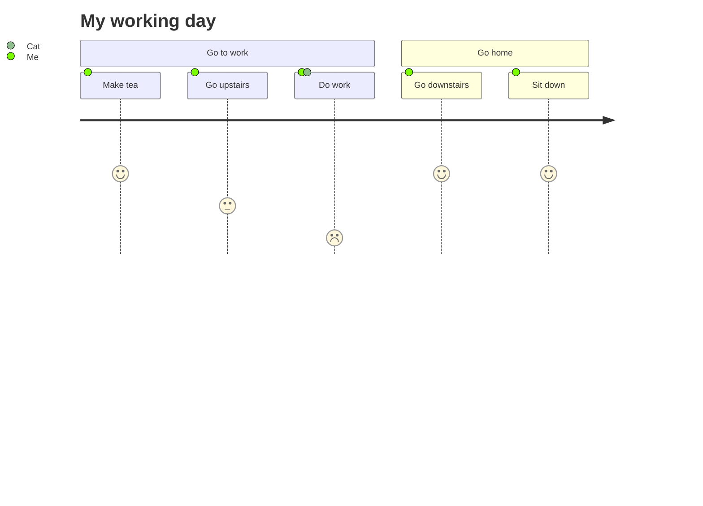

```mermaid
graph LR;
 client([client])-. Ingress-managed <br> load balancer .->ingress[Ingress];
 ingress-->|routing rule|service[Service];
 subgraph cluster
 ingress;
 service-->pod1[Pod];
 service-->pod2[Pod];
 end
 classDef plain fill:#ddd,stroke:#fff,stroke-width:4px,color:#000;
 classDef k8s fill:#326ce5,stroke:#fff,stroke-width:4px,color:#fff;
 classDef cluster fill:#fff,stroke:#bbb,stroke-width:2px,color:#326ce5;
 class ingress,service,pod1,pod2 k8s;
 class client plain;
 class cluster cluster;
 ```
