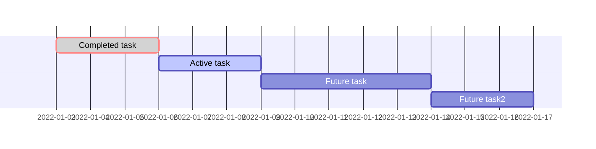
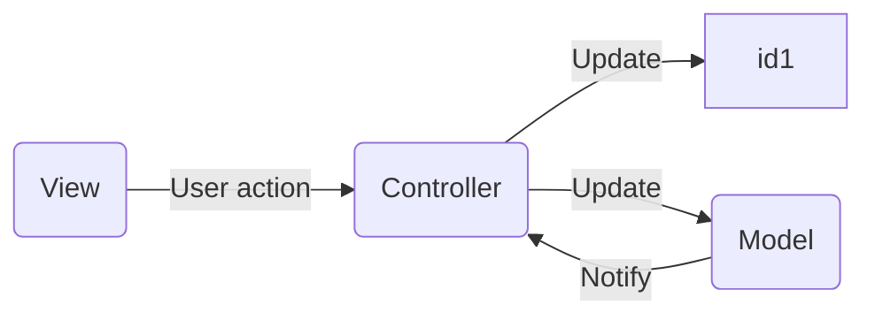
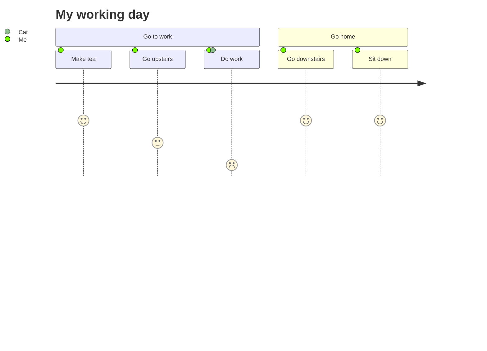

```mermaid
gantt
  Completed task :crit, done,    t1, 2022-01-03, 3d
  Active task    :      active,  t2, after t1,   3d
  Future task    :               t3, after t2,   5d
  Future task2   :                               3d
```

```mermaid
flowchart LR
  id(View) -- User action --> id2(Controller) -- Update --> id1
  id2(Controller) -- Update --> id3(Model) -- Notify --> id2
```

```mermaid
journey
    title My working day
    section Go to work
      Make tea: 5: Me
      Go upstairs: 3: Me
      Do work: 1: Me, Cat
    section Go home
      Go downstairs: 5: Me
      Sit down: 5: Me
```
